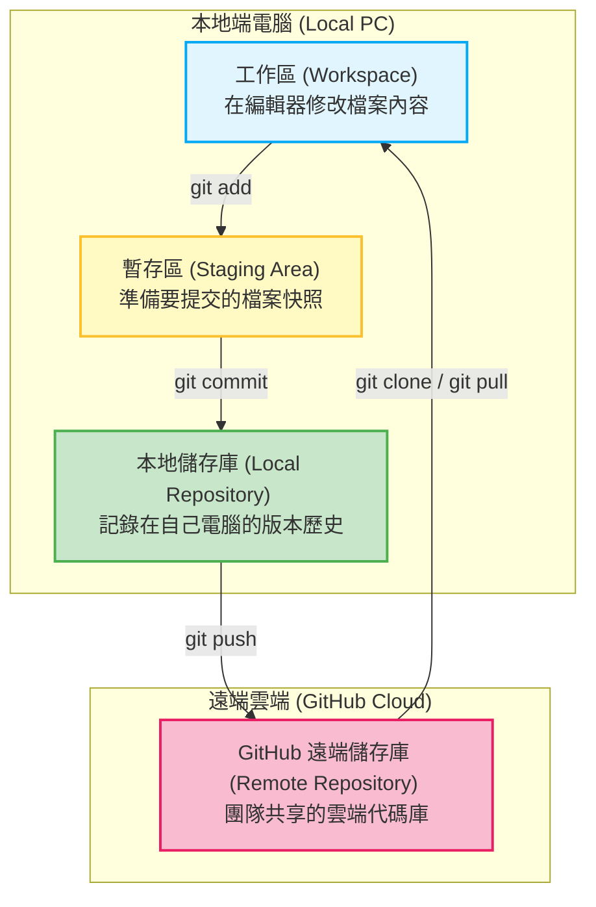
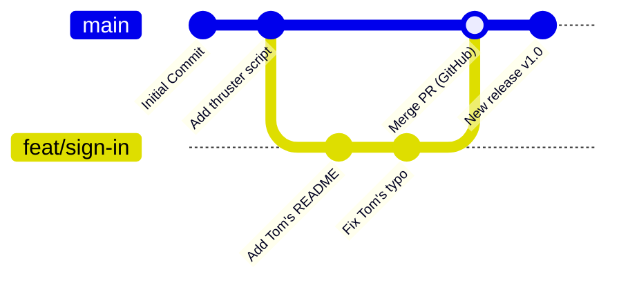

# 階段二：Linux、Git 與 AI 協作 🤝

在進入正式的 AUV 程式編寫之前，學員必須先學會「如何存活在 Linux 終端機」以及「如何與團隊、AI 協作」。

---

# 💻 學習清單與實作指引

---

## 🌐 【分類一】 Linux 終端機生存指南

在 AUV 開發中，絕大多數時間都不會使用 Windows 視窗，而是透過 SSH 連線至載具或在 Docker 容器內的終端機操作。學員必須熟練以下基礎 Linux 指令。

### 1. 開啟終端機 (Terminal) 的方式
* **原生 Ubuntu**：使用快捷鍵 `Ctrl + Alt + T` 可直接開啟一個新的終端機視窗。
* **WSL2 用戶**：在 VS Code 中安裝好 `WSL` 擴充套件後，點選左下角「連線至 WSL」，或在 Windows 中直接執行 `wsl` 命令。

### 2. 初學者必備 Linux 指令對照表

| 指令 | 功能說明 | 初學者立即可試的範例 | 💡 防呆 / 實用小提示 |
| :--- | :--- | :--- | :--- |
| **`cd [目錄]`** | 切換當前工作目錄 | `cd /etc/` | `cd ..` 可回到上一層，`cd ~` 可直接回到個人家目錄。 |
| **`ls -la`** | 列出當前目錄下的檔案與詳細資訊 | `ls -la` | `-a` 會連同以 `.` 開頭的隱藏檔（如 `.git`、`.env`）一起顯示出來。 |
| **`pwd`** | 顯示當前所在的絕對路徑 | `pwd` | 當您在目錄深處迷失方向時，使用這行指令立刻查出您在哪裡。 |
| **`mkdir [目錄名]`** | 建立新的資料夾 | `mkdir my_project` | 資料夾名稱不可有空白，建議使用底線 `_` 連接多個字詞。 |
| **`touch [檔名]`** | 建立空檔案或更新檔案時間 | `touch README.md` | 常配合編輯器用來快速創檔。 |
| **`cp [來源] [目的地]`** | 複製檔案或資料夾 | `cp conf.txt backup.txt` | 若要複製整個資料夾與內容，必須加上 `-r` 參數（例如 `cp -r src/ backup/`）。 |
| **`mv [來源] [目的地]`** | 移動檔案或將檔案改名 | `mv old.txt new.txt` | 在 Linux 中，「移動檔案」與「重新命名檔案」使用的是同一個指令。 |
| **`rm [檔名]`** | 刪除檔案 | `rm temp.txt` | **極度危險 ⚠️**：Linux 沒有資源回收桶！`rm -rf [路徑]` 會強制刪除，請再三確認。 |
| **`chmod [權限] [檔名]`** | 修改檔案或資料夾的權限 | `chmod +x run.sh` | `+x` 代表賦予「執行」權限，讓該檔案可以像程式一樣直接執行。 |
| **`sudo [指令]`** | 使用系統管理員（超級使用者）權限執行 | `sudo apt update` | 執行系統設定、軟體安裝等敏感操作時必須加上，會要求輸入您的密碼。 |
| **`htop`** | 視覺化系統資源與進度監控 | `htop` | 類似 Windows 的工作管理員，可以看 CPU/記憶體 佔用。按 `q` 鍵即可退出。 |
| **`df -h`** | 顯示磁碟空間使用量 | `df -h` | `-h` 代表以 GB, MB 等人眼好讀格式顯示，可用來檢查硬碟是否被 Log 塞滿。 |

---

## 🤖 【分類二】 AI Agent 協作心法 (Prompting)

不要把 AI 當成作弊工具，而是將其視為您的一對一程式助教。以下是 AUV 開發中，學員最常向 AI 發問的三大場景與提問範本。

### 1. 終端機報錯排除
當終端機噴出紅色錯誤訊息時，不要慌張，直接複製並對 AI 這樣問：
> 🙋 **提問範本**：
> 「我在 Ubuntu 24.04 環境中執行 `[貼上您執行的指令]` 時遇到以下錯誤，請幫我分析原因並給予逐步修復方案：
> ```
> [貼上完整的終端機紅字報錯訊息]
> ```」

### 2. 程式優化與 Code Review
當您寫完控制 AUV 的程式碼後，可以請 AI 扮演資深軟體工程師幫您檢視：
> 🙋 **提問範本**：
> 「這是我寫的 AUV `[描述功能，例如：推進器推力計算]` 控制程式碼，請幫我檢查是否有邏輯漏洞、記憶體洩漏或邊界條件錯誤，並在不改變功能的前提下進行效能優化與加入中文註解：
> ```python
> [貼上您的 Python 程式碼]
> ```」

### 3. Git / Docker 疑難解答
當您在使用版本控制或容器時遇到不熟的指令或冲突：
> 🙋 **提問範本**：
> 「我正在使用 Git 協作，遇到了 `[描述問題，例如：合併衝突 merge conflict]`，以下是當前的狀態，請一步步指引我如何排解：
> ```bash
> [貼上您打 git status 看到的狀態]
> ```」

---

## 🐙 【分類三】 Git & GitHub 團隊協作與版本管理概念

Git 是一個「分散式版本控制系統」，而 GitHub 則是存放 Git 歷史記錄的雲端平台。理解 Git 的核心，首先要理解檔案在「本地端」與「遠端」之間的流動。

### 1. Git 檔案流動圖 (工作流)

以下的 Mermaid 流程圖展示了您寫的程式碼如何從本地的「工作區」一步步推送到「GitHub 雲端」：



---

### 2. Git 分支與 Pull Request (PR) 協作概念

在團隊中，多個成員會同時修改代碼。為了避免互相覆蓋，我們會從主要分支（`main`）切出各自的「功能分支（feature branch）」，開發完成後再透過 **Pull Request (PR)** 審核機制合併回主分支：



---

### 3. Git 常用指令對照表

| Git 指令 | 功能說明 | 常用實用場景範例 | 💡 備註 / 防呆小提示 |
| :--- | :--- | :--- | :--- |
| **`git clone <倉庫網址>`** | 下載遠端儲存庫到本地端 | `git clone git@github.com:...` | 首次下載專案時使用，會在本地建立專案同名資料夾。 |
| **`git checkout -b <分支>`** | 建立並切換至新功能分支 | `git checkout -b feat/sign-in` | `-b` 代表 create branch，避免直接在 `main` 分支開發。 |
| **`git status`** | 檢查目前工作區檔案的修改狀態 | `git status` | 隨時都可以執行，用來確認有哪些檔案被修改或準備提交。 |
| **`git add <檔案>`** (或 `git add .`) | 將修改後的檔案加入暫存區 | `git add .` (暫存所有變更) | `.` 代表當前目錄。尚未 add 的檔案不會被 commit 紀錄。 |
| **`git commit -m "說明"`** | 將暫存區變更紀錄到本地歷史中 | `git commit -m "feat: add tom"` | 說明訊息必須清晰，以便團隊成員理解本次修改。 |
| **`git pull origin main`** | 從遠端主分支抓取並合併最新進度 | `git pull origin main` | 推送前建議先執行 pull，能有效防範/提早解決代碼衝突。 |
| **`git push origin <分支>`** | 將本地分支進度推送上傳至 GitHub | `git push origin feat/sign-in` | 只有 push 後，其他人才能在 GitHub 網頁上看到你的修改。 |

---

## 🏆 【分類四】 實作任務：【AUV 團隊簽到板】

透過實際發起 Pull Request (PR) 流程，讓學員體驗真實團隊的協作模式。

### 📋 任務步驟：
1. **造訪團隊 GitHub 儲存庫**：點擊進入我們 Orca AUV 團隊的 GitHub 專案網頁。
2. **複製專案到本地端** (在 Ubuntu 終端機執行)：
   ```bash
   git clone git@github.com:your-organization/auv-training-2026.git
   cd auv-training-2026
   ```
3. **建立並切換至您的功能分支**：
   ```bash
   # 分支命名規範：feat/sign-in-[您的名字]
   git checkout -b feat/sign-in-yourname
   ```
4. **建立您的簽到檔案**：
   * 在專案的 `members/` 資料夾下，建立一個以您英文名字命名的資料夾（使用 `mkdir` 指令）。
   * 在該資料夾下建立一個 `README.md`（使用 `touch` 指令）。
   * 使用 VS Code 或編輯器打開此 `README.md`，寫下簡單的自我介紹、您在 AUV 團隊中負責的次系統（如：控制、視覺、機構等）以及對今年的學習期許。
5. **本地端存檔提交**：
   ```bash
   # 1. 檢查目前修改的檔案狀態
   git status
   
   # 2. 將新增的資料夾與檔案加入暫存區
   git add .
   
   # 3. 提交存檔，附帶有意義的說明
   git commit -m "feat: add yourname to sign-in board"
   ```
6. **推送到 GitHub 遠端雲端**：
   ```bash
   git push origin feat/sign-in-yourname
   ```
7. **發起 Pull Request (PR)**：
   * 開啟瀏覽器回到 GitHub 專案網頁，您會看到一個黃色的提示框，顯示 `feat/sign-in-yourname had recent pushes...`。
   * 點選 **「Compare & pull request」**。
   * 在 PR 的描述中說明您已完成簽到，並點選 **「Create pull request」**。
8. **解決代碼衝突 (若有)**：
   * 若與其他學員的代碼發生衝突（Conflict），不用驚慌！請點選 GitHub 網頁上的 `Resolve conflicts` 或使用 AI 助手詢問「How to resolve git merge conflicts in VS Code」，排解後再次 commit 與 push 即可。
