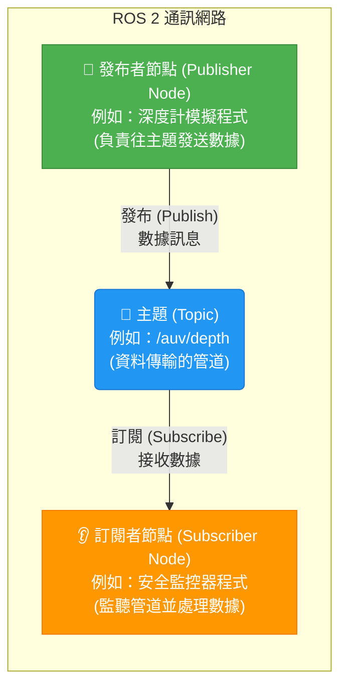

# 階段四：系統神經網路（ROS 2 架構與通訊） 🤖📡

這是 AUV 開發的核心。Ubuntu 24.04 原生對應的是 **ROS 2 Jazzy Jalisco**。學員將在此階段學會如何建立載具的「神經系統」，讓不同的感測器（如 IMU、深度計）與大腦（決策節點）進行資料交換。

---

### 🎨 ROS 2 核心通訊概念圖 (Publisher / Subscriber / Topic)

在進入代碼編寫前，請先理解 ROS 2 最基礎的「發布/訂閱」通訊邏輯。這就像是收音機廣播電台與聽眾的關係：



* **Topic (主題)**：是資料傳輸的虛擬管道。發布者與訂閱者只要「頻道（Topic 名稱）」對齊，就能順利收發資料，彼此不需要知道對方的存在。

---

## 📖 核心學習內容

### 1. ROS 2 Workspace 與 Colcon 編譯系統

* **Workspace (工作空間)**：這是開發 ROS 2 專案的根目錄。我們所有的套件原始碼都必須放在名為 `src` 的子資料夾中。
* **Colcon**：是 ROS 2 的專用編譯工具，它會掃描 `src` 目錄下的所有套件並自動進行編譯。

#### 🛠️ 建立工作空間的標準步驟：
打開終端機，依序輸入以下指令：

```bash
# 1. 建立工作空間目錄，並建立存放原始碼的 src 資料夾
mkdir -p ~/auv_ws/src
cd ~/auv_ws

# 2. 進行第一次編譯（此時 src 內還沒有程式碼，會自動生成 build, install, log 資料夾）
colcon build

# 3. 載入環境變數（這是最重要的一步！每次編譯完套件、或開啟新的終端機視窗，都必須執行此行，否則系統會找不到您的套件）
source install/setup.bash
```

---

### 2. Package (套件) 與 Node (節點)

* **Package (套件)**：是 ROS 2 程式碼的基本組織單位。您可以把套件想像成一個「功能抽屜」或「專案資料夾」，裡面包含設定檔（如 `package.xml`、`setup.py`）與多個執行檔。
* **Node (節點)**：是真正運行的程式實體（進程）。一個節點就像是一個「負責特定工作的工人的程式」。例如：一個節點專門讀取 IMU 姿態，另一個節點專門輸出推進器 PWM 訊號。

#### 💡 核心觀念：Package、Node 與通訊架構的關係

很多新手會混淆這些名詞。請記住這個關係鏈：

1. **工作空間 (Workspace)** 包含了多個 **套件 (Package)**。
2. 每個 **套件 (Package)** 底下，可以寫多個 Python 檔案，這些檔案被編譯執行後就是 **節點 (Node)**。
3. 這些 **節點 (Node)** 內部的程式碼，會宣告自己是 **發布者 (Publisher)** 還是 **訂閱者 (Subscriber)**。
4. 這些節點再透過 **主題 (Topic)** 這個資料管道進行資料收發。

> 簡單來說：**Package（程式工具箱 / 專案資料夾）** 裝著 **Nodes（節點程式）**，而 **Nodes（節點程式）** 藉由宣告為 **Publisher/Subscriber（通訊角色）** 在 **Topic（頻道）** 上進行溝通！


#### 🔌 什麼是 `rclpy`？
在建立套件時，我們會宣告依賴 `rclpy`。
`rclpy` 是 **ROS 2 Client Library for Python** 的縮寫。它是 ROS 2 官方為 Python 語言開發的 API 函式庫。所有我們在 Python 中呼叫的 ROS 2 功能（例如：建立節點、發布主題、計時器、日誌輸出等），都是透過 `import rclpy` 來調用的。

#### 🛠️ 建立套件的標準步驟：
```bash
# 1. 必須進入工作空間的 src 目錄下才能建立套件
cd ~/auv_ws/src

# 2. 建立一個 Python 類型的 ROS 2 套件，名為 auv_monitor，並宣告依賴 rclpy（Python API 庫）與 std_msgs（標準訊息格式）
ros2 pkg create --build-type ament_python auv_monitor --dependencies rclpy std_msgs
```
*(執行後，系統會自動在 `src` 底下生成一個 `auv_monitor` 資料夾，裡面有寫程式碼的目錄，以及告訴編譯器如何打包的 `setup.py` 與 `package.xml`)*

---

### 3. Topic (主題) 通訊機制

在 Python 中寫一個 ROS 2 節點時，我們通常會採用**物件導向 (OOP)** 的寫法，讓我們的節點類別繼承自 `rclpy.node.Node`。

以下是新手必須掌握的 Publisher 與 Subscriber 最基本的程式碼結構範本：

#### 📢 Publisher (發布者) 的極簡語法結構：
```python
import rclpy
from rclpy.node import Node
from std_msgs.msg import String # 載入字串訊息格式

class SimplePublisher(Node):
    def __init__(self):
        # 初始化節點名稱為 'simple_publisher'
        super().__init__('simple_publisher')
        
        # 1. 建立發布者物件 (訊息類型, 主題名稱, 佇列緩衝大小)
        self.pub = self.create_publisher(String, 'my_topic', 10)
        
        # 2. 設定一個定時器，每 1.0 秒自動執行一次 timer_callback 函式
        self.timer = self.create_timer(1.0, self.timer_callback)

    # 3. 定時器回呼函式 (Timer Callback)
    # 這是一個「事件驅動」的方法。每當定時器設定的時間到 (此處為 1.0 秒)，
    # ROS 2 系統就會在背景自動呼叫這個函式，執行我們想要定時做的事情（例如：發布感測器讀數）。
    def timer_callback(self):
        msg = String()
        msg.data = "Hello AUV!" # 設定訊息內容
        
        # 4. 發布訊息
        self.pub.publish(msg)
        self.get_logger().info(f'發布訊息: "{msg.data}"')

# 💡 真正啟動並執行這個類別的進入點
def main(args=None):
    rclpy.init(args=args)            # A. 初始化 ROS 2 的通訊系統
    node = SimplePublisher()         # B. 宣告與實例化節點物件 (從設計圖模具生出實體)
    rclpy.spin(node)                 # C. 卡住程式進行無限事件監聽循環 (執行 timer_callback)
    node.destroy_node()              # D. 按下 Ctrl+C 結束時清理資源
    rclpy.shutdown()                 # E. 關閉 ROS 2 通訊

if __name__ == '__main__':
    main()
```

#### 👂 Subscriber (訂閱者) 的極簡語法結構：
```python
import rclpy
from rclpy.node import Node
from std_msgs.msg import String

class SimpleSubscriber(Node):
    def __init__(self):
        # 初始化節點名稱為 'simple_subscriber'
        super().__init__('simple_subscriber')
        
        # 1. 建立訂閱者物件 (訊息類型, 主題名稱, 收到訊息時觸發的 Callback 函式, 佇列緩衝大小)
        self.sub = self.create_subscription(
            String, 
            'my_topic', 
            self.listener_callback, 
            10
        )

    # 2. 訂閱者回呼函式 (Listener Callback)
    # 這也是一個「事件驅動」的方法。我們不需要用 while 迴圈去持續監聽管道。
    # 每當 'my_topic' 管道有新資料傳入時，ROS 2 系統就會自動捕獲該訊息，並將訊息傳入並執行此函式。
    def listener_callback(self, msg):
        self.get_logger().info(f'成功接收到訊息: "{msg.data}"')

# 💡 真正啟動並執行這個類別的進入點
def main(args=None):
    rclpy.init(args=args)            # A. 初始化 ROS 2 的通訊系統
    node = SimpleSubscriber()        # B. 宣告與實例化節點物件
    rclpy.spin(node)                 # C. 卡住程式進行無限事件監聽循環 (監聽並執行 listener_callback)
    node.destroy_node()              # D. 按下 Ctrl+C 結束時清理資源
    rclpy.shutdown()                 # E. 關閉 ROS 2 通訊

if __name__ == '__main__':
    main()
```

---

#### ❓ 新手必問：為什麼在類別外要寫 `main()`？`rclpy.spin()` 又是做什麼的？

您會發現上面的範例程式碼除了 Class（類別設計圖）之外，最下方都包含了 `main()` 進入點。這是因為 **Class 只是設計藍圖**，必須在外部透過程式指令來驅動它：

1. **宣告與實例化物件**：`node = SimplePublisher()` 這行程式碼正是用來**宣告與建立節點實體**的關鍵。沒有這一行，我們的設計圖就只是一行行靜態文字，不會真正被電腦分配記憶體並執行。
2. **`rclpy.spin(node)` 的作用**：在一般 Python 程式中，如果我們想持續執行，可能需要自己寫 `while True:` 迴圈。但在 ROS 2 中，我們絕對不能自己寫死迴圈（那會卡死 CPU 且無法接收其他事件）！
   - `spin(node)` 會接管整個程式的控制權，進入一個**高效的事件監聽與排程循環**。
   - 它會在背景自動檢查：定時器時間到了嗎？有的話就去執行 `timer_callback`；訂閱的主題收到新資料了嗎？有的話就去執行 `listener_callback`。
   - 這就是為什麼我們的節點程式完全不需要自己寫 `while` 迴圈，也能不間斷、高效率地收發訊息的背後祕密。
3. **`if __name__ == '__main__':` 的含意**：這是 Python 的標準啟動防護罩。
   - 當我們**直接在終端機執行**這個檔案時（例如執行 `python3 my_node.py`），Python 會自動把該檔案的內建隱藏變數 `__name__` 設定為 `'__main__'`，進而觸發執行下方的 `main()` 進入點。
   - 相反地，如果這個檔案是被其他程式用 `import` 載入作為模組引用時，它的 `__name__` 就會是它的檔案名稱（如 `simple_publisher`）而不會等於 `'__main__'`。此時，下方的 `main()` 就不會自動被執行，這能有效防止節點在被載入時誤啟動。

這就是為什麼在後面實作小專案的 Python 檔案中，最下面都有 `def main():` 的原因。當我們執行該節點時，系統會先呼叫 `main()` 宣告出物件，再用 `spin()` 開始監聽。

---

### 4. 終極多容器部署：Docker Compose

在 AUV 的真實開發中，我們可能需要同時啟動許多個服務，例如「推進控制節點」、「相機影像辨識節點」與「任務決策節點」。如果每次啟動都得手動開啟多個終端機、輸入長長的 `docker run` 指令，不僅容易打錯，也極難維護。

Docker Compose 就是為了解決這個問題而誕生的工具。它允許我們使用一份 `docker-compose.yml`（YAML 格式的純文字檔）來定義整個 AUV 系統的所有服務，然後**一鍵啟動**所有容器。

#### 📝 Docker Compose 與 docker run 的防呆對照表

| 需求情境 | docker run (手動終端機指令) | docker-compose.yml (自動化設定) |
| :--- | :--- | :--- |
| **映像檔** | `auv-thruster-calc:v1.0` | `image: auv-thruster-calc:v1.0` |
| **網路設定** | `--network host` | `network_mode: "host"` |
| **硬體掛載** | `--device /dev/ttyUSB0` | `devices:`<br>&nbsp;&nbsp;`- "/dev/ttyUSB0:/dev/ttyUSB0"` |
| **目錄掛載** | `-v $(pwd):/app` | `volumes:`<br>&nbsp;&nbsp;`- ./:/app` |

#### 🚀 Docker Compose 核心起手式指令

寫好設定檔後，所有的繁瑣啟動指令都化繁為簡：
* **一鍵背景啟動所有服務**：
  ```bash
  docker compose up -d
  ```
  > 💡 **提示**：`-d` 代表在背景執行（Detached mode），您的終端機不會被卡住，可以繼續輸入其他指令。
* **查看所有服務的運行狀態**：
  ```bash
  docker compose ps
  ```
* **即時查看特定服務的輸出日誌 (Log)**：
  ```bash
  # 即時查看影像辨識節點的輸出情況
  docker compose logs -f vision_node
  ```
* **一鍵停止並刪除所有服務**：
  ```bash
  docker compose down
  ```

---

## 🛠️ 實作小專案：【深度監控警報系統】

編寫兩個 ROS 2 節點：**Node A** 負責模擬深度計發送數據，**Node B** 負責接收數據並在水深過深時發出警告。

### 步驟一：撰寫 Node A (Sensor Mock - 發布者)
在 `auv_monitor/auv_monitor/sensor_mock.py` 寫入：
```python
import rclpy
from rclpy.node import Node
from std_msgs.msg import Float32
import random

class SensorMockNode(Node):
    def __init__(self):
        super().__init__('sensor_mock')
        # 建立一個發布者，發布至 /auv/depth 主題，訊息類型為 Float32，佇列大小為 10
        self.publisher_ = self.create_publisher(Float32, '/auv/depth', 10)
        
        # 每秒觸發一次定時器發布數據
        self.timer = self.create_timer(1.0, self.publish_depth)
        self.current_depth = 1.0

    def publish_depth(self):
        msg = Float32()
        # 模擬深度在 0.5 ~ 4.0 米之間隨機波動與遞增
        self.current_depth += random.uniform(-0.2, 0.5)
        msg.data = max(0.0, self.current_depth)
        
        self.publisher_.publish(msg)
        self.get_logger().info(f'發布當前深度數據: {msg.data:.2f} m')

def main(args=None):
    rclpy.init(args=args)
    node = SensorMockNode()
    rclpy.spin(node)
    node.destroy_node()
    rclpy.shutdown()
```

---

### 步驟二：撰寫 Node B (Safety Monitor - 訂閱者)
在 `auv_monitor/auv_monitor/safety_monitor.py` 寫入：
```python
import rclpy
from rclpy.node import Node
from std_msgs.msg import Float32

class SafetyMonitorNode(Node):
    def __init__(self):
        super().__init__('safety_monitor')
        # 建立訂閱者，監聽 /auv/depth 主題
        self.subscription = self.create_subscription(
            Float32,
            '/auv/depth',
            self.depth_callback,
            10
        )
        # 設定安全警戒深度為 3.0 米
        self.SAFE_LIMIT = 3.0

    def depth_callback(self, msg):
        current_depth = msg.data
        if current_depth > self.SAFE_LIMIT:
            self.get_logger().warn(
                f'⚠️ [🚨 警報] 偵測到危險水深: {current_depth:.2f} m (安全上限: {self.SAFE_LIMIT} m)！'
            )
        else:
            self.get_logger().info(
                f'正常運作中。深度: {current_depth:.2f} m'
            )

def main(args=None):
    rclpy.init(args=args)
    node = SafetyMonitorNode()
    rclpy.spin(node)
    node.destroy_node()
    rclpy.shutdown()
```

---

### 步驟三：撰寫專案的 Dockerfile

為了將我們的 ROS 2 程式包裝為可移植的映像檔，我們需要在工作空間根目錄下建立一個 `Dockerfile`：

```dockerfile
# 1. 使用官方 ROS 2 Jazzy 基礎映像檔
FROM osrf/ros:jazzy-desktop

# 2. 設定容器內的工作目錄
WORKDIR /auv_ws

# 3. 將本地的 src 原始碼目錄複製到容器中
COPY ./src ./src

# 4. 編譯 ROS 2 工作空間
RUN . /opt/ros/jazzy/setup.sh && colcon build

# 5. 設定 Entrypoint，啟動時自動加載環境變數
ENTRYPOINT ["/bin/bash", "-c", "source /opt/ros/jazzy/setup.bash && source /auv_ws/install/setup.bash && exec \"$@\""]
```

---

### 步驟四：撰寫 docker-compose.yml 啟動檔

使用 Docker Compose 來一鍵啟動這兩個相互通訊的節點。在工作空間根目錄下建立一個名為 `docker-compose.yml` 的檔案：

```yaml
services:
  # 服務一：模擬深度發布節點
  sensor_mock:
    image: auv-monitor:v1.0
    build: .
    container_name: auv_sensor_mock
    network_mode: "host" # 使用 host 網路模式，確保 ROS 2 DDS 能與其他節點正常通訊
    command: ros2 run auv_monitor sensor_mock

  # 服務二：安全監控接收節點
  safety_monitor:
    image: auv-monitor:v1.0
    build: .
    container_name: auv_safety_monitor
    network_mode: "host"
    command: ros2 run auv_monitor safety_monitor
```

---

### 步驟五：一鍵啟動與驗證

1. 請在終端機中確認路徑在專案目錄下，執行以下指令建立並啟動服務：
   ```bash
   docker compose up -d
   ```
2. 查看服務是否已經成功啟動並在背景運行：
   ```bash
   docker compose ps
   ```
3. 即時監看 **Safety Monitor** 節點的輸出日誌，確認是否有收到深度數據：
   ```bash
   docker compose logs -f safety_monitor
   ```
   *(當深度計模擬的值超過 `3.0` 時，您應該會看到畫面上噴出黃色的 `⚠️ [🚨 警報] 偵測到危險水深...` 訊息)*
4. 驗證完成後，一鍵停止並清理所有的容器：
   ```bash
   docker compose down
   ```
