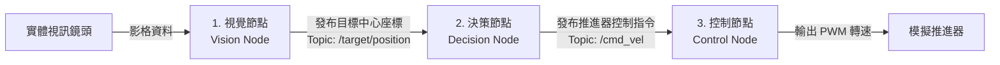

# 階段六：終極試煉（整合專案開發） 🏆⚓

本階段是整套培訓的總驗收。學員將把前面所學的 **Linux 指令、Git 協作、Python OOP、Docker 容器化、ROS 2 通訊 與 YOLO 視覺** 串聯在一起，模擬 AUV 水底尋標與自主跟蹤的決策控制鏈。

---

## 🛠️ 整合專案：【AUV 尋標與攔截模擬系統】

這個系統模擬 AUV 發現目標（如浮標）後，主動調整航向進行撞擊的過程。系統包含三個互相關聯的 ROS 2 節點：

### 1. 視覺節點 (Vision Node)
* **職責**：讀取視訊鏡頭畫面，調用在階段五微調的 YOLOv8 模型。
* **行為**：
  * 當辨識到目標（如紅色浮標）時，計算目標在影像中的 X 軸中心座標（正常範圍為 `0` ~ `640`，中間點為 `320`）。
  * 發布該座標資料至 Topic：`/target/position` (自訂或標準 Message 類型)。

### 2. 決策節點 (Decision Node)
* **職責**：訂閱 Topic `/target/position`。
* **行為**：
  * 比對目標中心點與畫面正中央 (`320`) 的偏差量 (Error)。
  * 利用簡單的比例控制 (P 控制) 計算轉向角度：
    * 若目標偏左 (例如座標 `< 320`) -> 輸出向左轉指令。
    * 若目標偏右 (例如座標 `> 320`) -> 輸出向右轉指令。
  * 發布轉向與前進速度指令至 Topic：`/cmd_vel` (使用 ROS 2 標準的 `geometry_msgs/msg/Twist`)。

### 3. 控制節點 (Control Node)
* **職責**：訂閱 Topic `/cmd_vel`。
* **行為**：
  * 接收決策節點的速度與轉向指令。
  * 調用階段三寫的「推進器推力計算類別」，將其轉換為左、右推進器對應的模擬 PWM 訊號。
  * 在終端機上即時印出：
    > `[OUTPUT] 左馬達 PWM: 1650 us | 右馬達 PWM: 1350 us (正在向右修正修正...)`

---

## 🤖 AI Agent 進階應用

在此階段，我們強烈鼓勵學員多與 AI 助教互動以解決以下現實挑戰：
1. **影像延遲問題**：若相機讀取與 YOLO 偵測導致畫面卡頓，詢問 AI：
   > 「我的 ROS 2 視覺節點處理 YOLOv8 推論時會卡頓，請問該如何使用 Python 的多執行緒 (Threading) 或將推論移至獨立 Thread 來避免主迴圈被卡住？」
2. **控制超調與抖動**：如果 AUV 模擬轉向時晃動過於劇烈，請教 AI：
   > 「我的 P 控制器在目標接近中央時會發生左右劇烈抖動（超調），請問該如何加入微積分項（PID 控制器）來平滑轉向輸出？請提供 Python 代碼範例。」

---

## 🎓 結業標準

* 學員必須以 **Git 協作方式** 分工完成此專案（有人負責視覺、有人負責控制與決策）。
* 專案代碼必須整理好並在 **Docker 容器內編譯與編譯成功**。
* 實際開啟筆電鏡頭，將目標物往左移動時，控制節點的終端機能夠顯示對應的馬達修正輸出。這即代表您的團隊已經擁有了開發一台真正 AUV 核心軟體系統的基礎實力！
